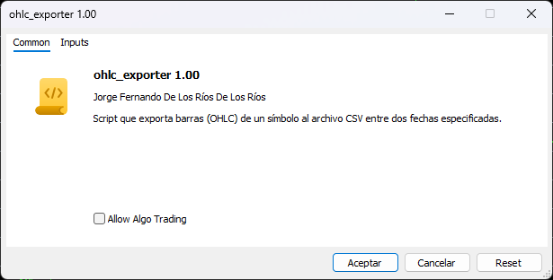
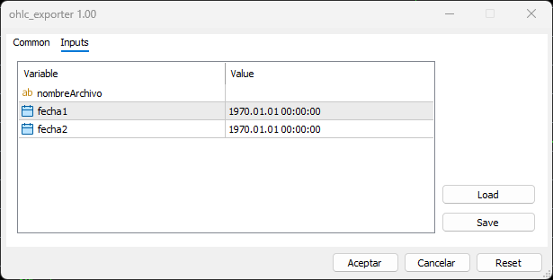

# ohlc_exporter

Descripción

Script para MetaTrader (MQL5/MQL4) que exporta barras (OHLC) de un símbolo al archivo CSV entre dos fechas especificadas.

Entradas

- nombreArchivo (string): nombre del archivo de salida (sin extensión). Si queda vacío se usa el símbolo activo que está cargado en el gráfico.
- fecha1 (datetime): fecha límite (uno de los extremos del periodo).
- fecha2 (datetime): fecha límite (el otro extremo del periodo).

Comportamiento
- Normaliza el nombre (recorta espacios en compilaciones compatibles). Si el nombre final es vacío usa _Symbol y añade la extensión `.csv`.
- Evita sobrescribir: si el archivo ya existe aborta la operación.
- Recupera las barras del símbolo activo en el periodo actual entre las dos fechas con CopyRates.
- Crea un fichero CSV en codificación ANSI, separador coma, con encabezado:
  `<TICKER>,<DTYYYYMMDD>,<TIME>,<OPEN>,<HIGH>,<LOW>,<CLOSE>,<VOL>`
- Para cada barra escribe una línea con:
  - Símbolo
  - Fecha en formato YYYYMMDD
  - Hora en formato HHMM
  - Open, High, Low, Close (formateados según _Digits)
  - Tick volume
- Muestra por Print el progreso en porcentaje durante la generación.
- Si ocurre un error (CopyRates, TimeToStruct, apertura de fichero, etc.) intenta cerrar y eliminar el fichero parcial y muestra el error por Print.

Formato del CSV
- Codificación: ANSI
- Separador: coma (,)
- Cabecera: tal como se indica arriba
- Ejemplo de línea:
  EURUSD,20251116,1530,1.08234,1.08300,1.08150,1.08290,123

Salida y ubicación
- Archivo guardado en la carpeta de archivos del terminal:
  TerminalInfoString(TERMINAL_DATA_PATH)\MQL5\Files  (o `\MQL4\Files` en compilaciones MQL4)
- El nombre final es `nombreArchivo.csv` o `_Symbol.csv` si no se proporcionó nombre.

Limitaciones y notas
- No valida todos los caracteres especiales ni la longitud máxima del nombre de archivo (se recomienda usar nombres simples, sin caracteres inválidos).
- El rango de fechas se normaliza internamente (la fecha menor y la mayor se detectan con MathMin/MathMax).
- Diseñado para PERIOD_CURRENT; cambiar periodo requeriría modificar el código.
- Compilaciones condicionales incluidas para MQL4/MQL5.

Autor
- Jorge Fernando De Los Ríos De Los Ríos — jfdelosrios@hotmail.com

Licencia
- Libre para uso personal; revisar y ajustar según necesidades comerciales o redistribución.